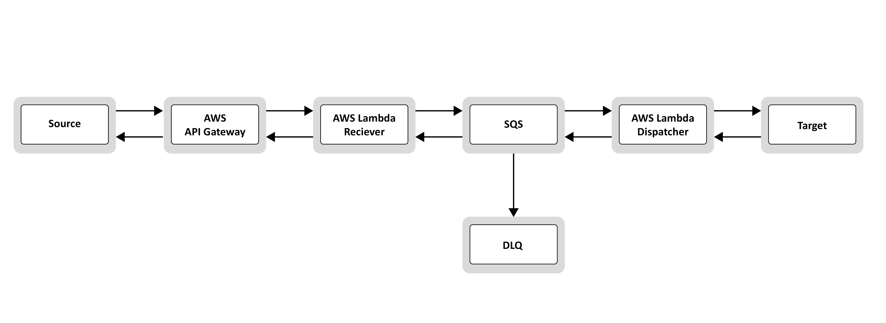
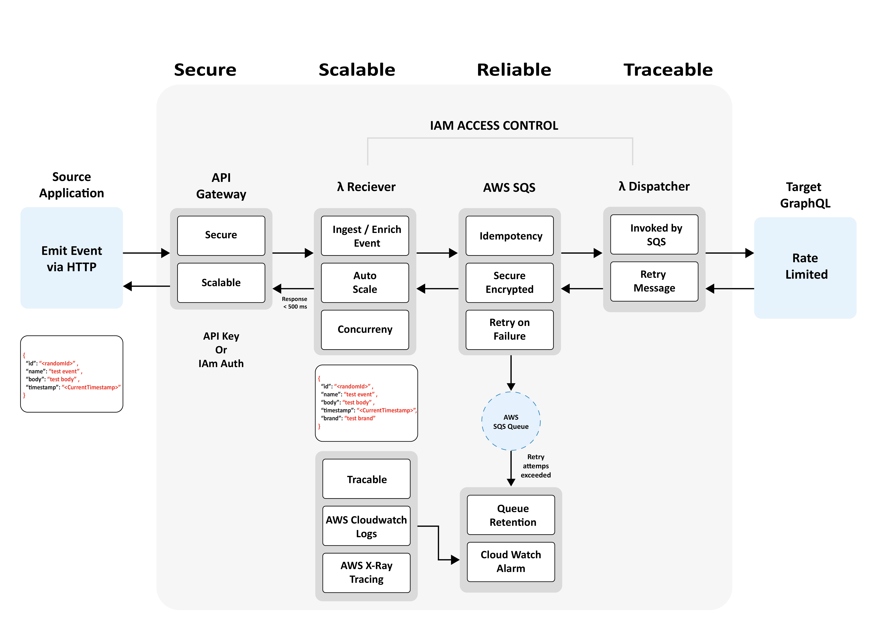

# Event Gateway Service

**event-gateway-service** is a cloud-native, serverless, event-driven architecture that connects high-speed event producers (source applications) with rate-limited consumers (target GraphQL APIs). Designed using **AWS**, **Node.js (TypeScript)**, and **Terraform**, it ensures **reliability**, **scalability**, **security**, and **traceability**, based on architectural best practices.

## Table of Contents

- [Key Highlights](#key-highlights)
- [Architecture Diagrams](#architecture-diagrams)
- [Folder Structure](#folder-structure)
- [How to Run Locally](#how-to-run-locally)
- [Deployment](#deployment)
- [Testing Strategy](#testing-strategy)
- [Observability](#observability)
- [Security Best Practices](#security-best-practices)
- [Documentation](#documentation)
- [How to Run Locally](#How-to-Run-Locally)

---

## Key Highlights

| Feature        | Description                                                                 |
|----------------|-----------------------------------------------------------------------------|
| High-Throughput Ingestion | Handles thousands of events per second from source systems via API Gateway |
| Secure & Authenticated | API Gateway secured using API Keys/IAM; all data encrypted in-transit & at-rest |
| Scalable & Resilient | Uses SQS and Lambda for automatic horizontal scaling and durable buffering |
| Reliable & Fault-Tolerant | Built-in retries with DLQ for failed messages and graceful degradation |
| Observability & Tracing | Full logging via CloudWatch, tracing with X-Ray, and alerts for operational visibility |
| CI/CD Integrated | Fully automated with GitHub Actions and Terraform for zero-downtime deployment |
| Well-Tested | Includes unit tests (Jest), integration tests (AWS) |
| Infrastructure as Code | Reproducible infra with Terraform, environments managed via GitHub Actions |

---

## Architecture Diagrams

### High-Level Design (HLD)



This diagram shows the overall flow of events from the source application to the target GraphQL service, ensuring decoupling, reliability, and visibility.

### Low-Level Design (LLD)



This provides a deeper technical breakdown of each component in the system, including logging, retries, rate-limiting strategy, and traceability mechanisms.

---

## System Components

---

### Source Application

- Emits an **HTTP event** to an **API Gateway** endpoint.
- The **API Gateway** supports:
  - API Key authentication
  - IAM authentication
  - CORS (enabled optionally for web clients)
- API Gateway is **scalable** and designed to handle **burst traffic** with no performance degradation.

---

### Receiver Lambda (Ingestion)

- Fronted by API Gateway to receive event data.
- Written in **Node.js with TypeScript**.
- Responsibilities:
  - Parses and validates incoming event.
  - **Enriches event** with an extra attribute:  
    ```ts
    brand: "testBrand"
    ```
  - Sends enriched event to **Amazon SQS (Standard Queue)**.
  - Immediately returns a **2xx response within 500ms** if successful.
  - Returns **non-2xx response** in case of failure.

#### Security
- IAM role permits:
  - Only `sqs:SendMessage` to the specific queue.
  - CloudWatch logging and X-Ray tracing.
- All data is encrypted:
  - In transit (HTTPS)
  - At rest (SQS encryption)

---

### SQS Buffering Queue

- Standard SQS queue used for **high-throughput buffering**.
- Ensures **event durability** and **decouples source from target**.
- Configurations:
  - **Visibility timeout** ~6x Lambda timeout (e.g., 60s).
  - **DLQ** captures messages after max retries.
  - **Retention period**: 4+ days to allow time for recovery if the target is down.
- Built-in **idempotency support** for duplicate handling.
- Scales automatically without any need for manual intervention.
- Fully monitored with **CloudWatch metrics & alerts**:
  - Queue depth
  - Age of oldest message

---

### Dispatcher Lambda (Processor)

- Triggered by the SQS queue.
- Processes messages **one at a time** (or in small batches).
- Responsibilities:
  - Reads event
  - Calls **GraphQL API** with a defined mutation
  - Handles:
    - Success
    - **Retries** (on 429 or 5xx)
    - **DLQ fallback** if repeated failures

#### Configuration & Reliability
- **Concurrency throttled** (e.g., 5) to respect rate limits.
- Timeout set to **10 seconds** for responsiveness.
- AWS X-Ray enabled for detailed tracing.
- Logs include:
  - `eventId`
  - Status
  - Retry count
- **Idempotence guaranteed** using unique `id` field.

---

### Target GraphQL API

- Mock API simulates real behaviour with rate limits (e.g., 5 req/sec).
- In real-world:
  - May require authentication (API Key, OAuth).
  - Dispatcher securely retrieves credentials from:
    - AWS Secrets Manager
- GraphQL request:
  - Uses **mutation** with `input` event data.
  - Handles response:
    - 200 = success
    - errors = retry or DLQ

---

## Tech Stack

- **Node.js** with **TypeScript**
- **AWS Lambda**, **API Gateway**, **SQS**, **DLQ**
- **Terraform** (Infrastructure-as-Code)
- **GitHub Actions** (CI/CD)
- **AWS CloudWatch**, **AWS X-Ray**

---

## CI/CD Workflow

The `deploy.yml` GitHub Actions pipeline includes:

1. **Build & Test**  
   - Run linting, unit tests, and packaging
   - Artifacts uploaded: `receiver.zip`, `dispatcher.zip`

2. **Deploy Infrastructure**  
   - Uses Terraform to deploy Lambdas.
   - Environments isolated by directory structure

---

## Testing Strategy

| Level | Tools & Strategy |
|-------|------------------|
| **Unit Tests** | Jest, mocks for AWS SDK, GraphQL calls |
| **Integration** | End-to-end via AWS dev |
| **Failure Scenarios** | Simulated GraphQL rate limits, DLQ handling |
| **CI Validations** | ESLint, `terraform fmt`, `terraform validate`, full test suite |

---

## Observability (AWS Setup)

| Tool        | Purpose                                              |
|-------------|------------------------------------------------------|
| CloudWatch  | Lambda logs, SQS queue depth, DLQ monitoring         |
| X-Ray       | End-to-end tracing of events across AWS components   |
| Alarms      | Triggered on high error rate, message age, DLQ fill  |

---

## Security Best Practices

- **IAM Roles** follow least privilege principle
- **API Gateway** secured via **API Key** or **IAM**
- **Encryption** at rest and in transit for all data (SQS, logs, secrets)
- **Secrets** stored in **AWS Secrets Manager** or **SSM Parameter Store**
- **No hardcoded credentials**, GitHub OIDC used for AWS access

---

## How to Run Locally

```bash
# Clone the repo
git clone https://github.com/your-org/event-gateway-service.git
cd event-gateway-service

# Install dependencies
npm install

# Run lint & tests
npm run lint
npm test

# Build project
npm run build

# Zip lambdas
npm run zip:all

## Deployment

Deployment is fully automated using GitHub Actions:

- Push to `develop` = auto-deploy to `dev` environment
- Pull request to `main` = triggers pipeline

**Adjust GitHub secrets:**

- `AWS_ACCESS_KEY_ID`
- `AWS_SECRET_ACCESS_KEY`
- `AWS_REGION`

**Manual Terraform deployment:**

```bash
cd infrastructure/environments/dev
terraform init
terraform plan
terraform apply
